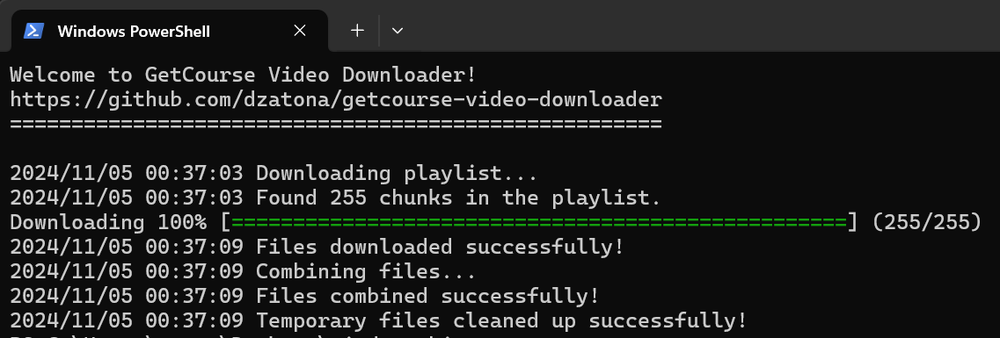

# Download GetCourse videos without transcoding

This software allows you to download HLS video streams from GetCourse without loss of quality, without the need for transcoding, and to merge them into a single video file. The program is written in Go language and is designed for use in **Windows** operating system.  

You can find compiled binaries in the [latest release](https://github.com/SijyKijy/getcourse-video-downloader/releases/latest).



## 0. Pre-requisites

**Software requires `ffmpeg` to work.**

### – Download FFmpeg

Download `ffmpeg` from [https://ffmpeg.org/download.html](https://ffmpeg.org/download.html) and add it to your system's PATH using the following PowerShell command (run as administrator):

Example command:
```ps
[Environment]::SetEnvironmentVariable("Path", $env:Path + ";C:\ffmpeg\bin", "Machine")
```

## 1. How to get a link to a video

* Open the page with the video in Chromium / Google Chrome browser.
* Right-click on the video, select "View Code".
* In the developer panel that opens, open the "Network" tab.
* Reload the page in your browser.
* Select the desired video resolution in the GetCourse video player settings.
* Start playing the video, let it play for a couple of seconds, then pause it.
* Find and copy the link ("Request URL") to the downloaded file with a number name that matches the resolution of the video in the player (360, 720, 1080, etc.).


### Generator
You can use a [generator site](https://sijykijy.github.io/getcourse-video-downloader-win/website/).
To do this, you need to copy the html code of the frame with the video and paste it into the site


## 2. Running the program

### – If you're new

Simply [download](https://github.com/SijyKijy/getcourse-video-downloader/releases/latest) the program binary and run it with the following parameters on Windows:

`.\getcourse-video-downloader.exe 'https://player02.getcourse.ru/api/playlist/media/...' aboba.mp4`

### – If you're a dev

You know what to do.

## Thanks to

The general logic is inspired by [mikhailnov](https://github.com/mikhailnov/getcourse-video-downloader), but his solution at the moment of publishing this readme has a significant problem with sound in clips after assembling them (obvious clicks at the beginning of each segment of the HLS video stream).
